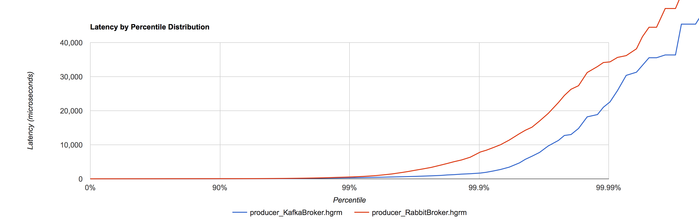

# Message Broker Performance Tests

This is some *very* basic performance test rig for comparing the performance of
message brokers. The test setup is very basic, just shovelling small messages over
the loopback interface to a local consumer. It is therefore just a test of absolute
best-case raw throughput and latency figures for one particular use-case.

## Running the tests

```bash
bash src/main/resources/run-tests.sh
```

## Results

See raw data in the `./data` directory. Headline figures:

### Producers
```
Kafka:  Sent 100000 messages of 544 bytes in 7678ms. Total MiB sent: 51.88
Rabbit: Sent 100000 messages of 544 bytes in 9755ms. Total MiB sent: 51.88
```



### Consumers

```
Kafka:  Consumed 100000 messages in 7300ms
Rabbit: Consumed 100000 messages in 9475ms
```


### Summary

Kafka is generally faster than Rabbit for producers and consumers in these single-broker tests - about 2 seconds
faster (~20%) in the end-to-end timing. This is a significant performance win for our use-cases. For producers,
it provides per-message latencies that are consistently lower across the entire percentile range. For consumers, Rabbit
has a slightly better median latency, but this is completely dominated by significantly worse latencies from around the
95th percentile.

For raw throughput, the numbers indicate that Rabbit is able to achieve an average of around 425Mbit/s transfer rate 
(NB: this is the effective transfer rate seen by the application, the wire protocol will be transferring more data 
than that) on the local loopback interface on this machine. Kafka is achieving 540Mbit/s for the same test, so 
actually around 27% faster by throughput. It seems likely that either technology could saturate a 1Gbit/s network connection
with just 2 or 3 broker instances.

Given that Kafka is designed for very high scalability, it is likely that these numbers will widen even favour in Kafka's
favour in larger scale tests, but these remain to be performed.
