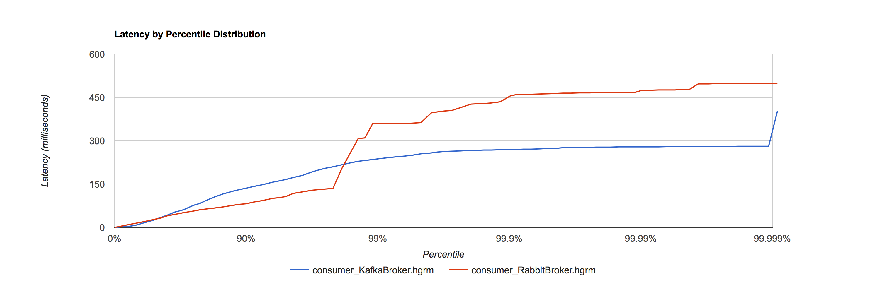

# Message Broker Performance Tests

This is some *very* basic performance test rig for comparing the performance of
message brokers. The test setup is very basic, just shovelling small messages over
the loopback interface to a local consumer. It is therefore just a test of absolute
best-case raw throughput and latency figures for one particular use-case.

## Running the tests

```bash
bash src/main/resources/run-tests.sh
```

## Results

See raw data in the `./data` directory. Headline figures:

### Producers
```
Kafka:  Sent 100000 messages of 544 bytes in 7678ms. Total MiB sent: 51.88 (54.1 Mbit/s)
Rabbit: Sent 100000 messages of 544 bytes in 9755ms. Total MiB sent: 51.88 (42.5 Mbit/s)
```


### Consumers

```
Kafka:  Consumed 100000 messages in 7300ms
Rabbit: Consumed 100000 messages in 9475ms
```



# Increasing concurrency

The initial tests run both the producer and the consumer in a single thread. We can increase the concurrency on both
using Java 8 parallel streams. I have re-run the tests with both the producer and consumer using a thread for each
available CPU core (4 on this machine). The performance for Kafka improves dramatically (raw data is in data/parallel):

```
Kafka Producer: Sent 100000 messages of 544 bytes in 3015ms
                Total MiB sent: 51.88 (137.7 Mbit/s)
Kafka Consumer: Consumed 100000 messages in 4927ms

Rabbit Producer: Sent 100000 messages of 544 bytes in 10627ms
                 Total MiB sent: 51.88 (39.1 Mbit/s)
Rabbit Consumer: Consumed 100000 messages in 10142ms
```

We can see from this that Kafka benefits immensely from parallel producers and consumers, achieving over double the 
throughput on the producer side and significant time reduction on the consumer side. Rabbit on the other hand sees 
no benefit from increased concurrency on either end, and in fact a slight slowdown. The Kafka producer is over 3.5 
times faster than Rabbit in this test!

The latency distributions for the producers are given below, showing Kafka producing messages faster across the board:


